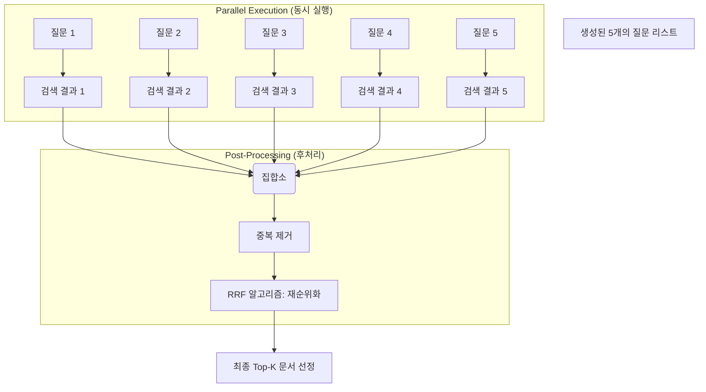

```mermaid
graph TD
    Input(User Input: question) --> GlobalState
    
    subgraph "RAG Engine Loop"
        GlobalState[RAGGlobalState <br/> {question}]
        
        %% Node 1
        GlobalState --"Input: question"--> Node1[Query Rewrite]
        Node1 --"Return: optimized_query"--> Merge1(Update State)
        Merge1 --> State1[RAGGlobalState <br/> {question, optimized_query}]
        
        %% Node 2
        State1 --"Input: optimized_query"--> Node2[Retriever]
        Node2 --"Return: retrieved_docs"--> Merge2(Update State)
        Merge2 --> State2[RAGGlobalState <br/> {question, optimized_query, docs}]
        
        %% Node 3
        State2 --"Input: question, docs"--> Node3[Generator]
        Node3 --"Return: final_answer"--> Merge3(Update State)
        Merge3 --> StateFinal[RAGGlobalState <br/> {All Fields Filled}]
    end
    
    StateFinal --> Output(Final Output: final_answer)
```

