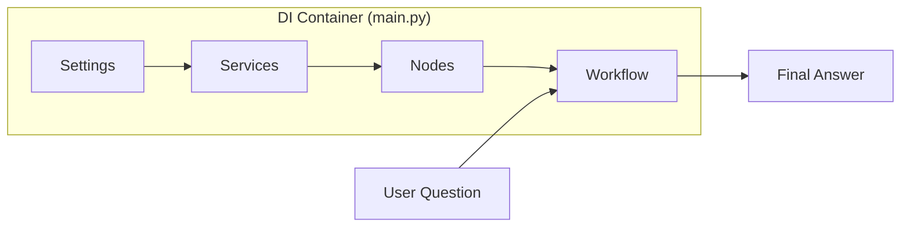
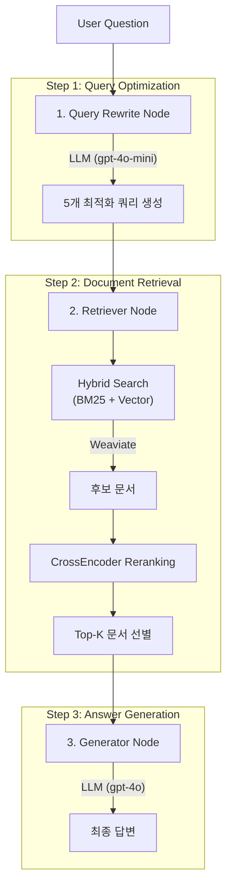
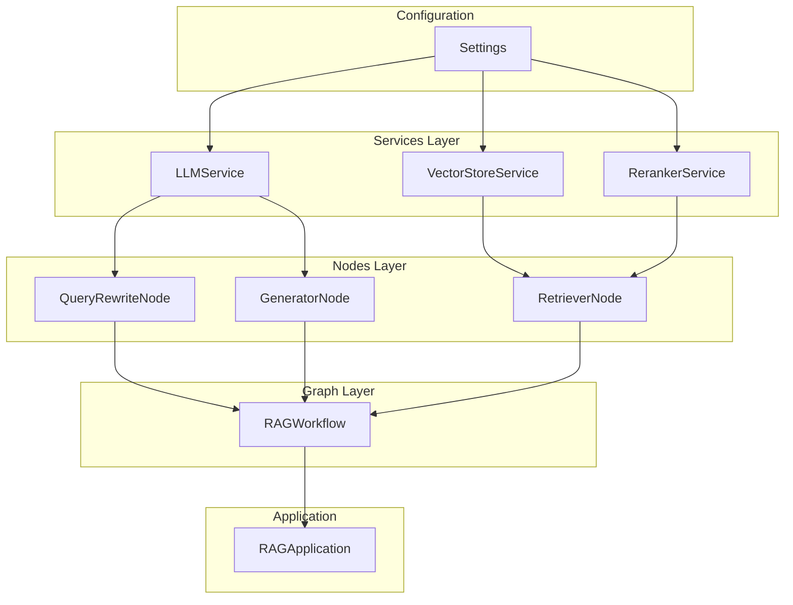

# RAG Server v2

LangGraph 기반의 모듈화된 RAG(Retrieval-Augmented Generation) 파이프라인

## Architecture Overview



## Project Structure

```
dev_v2/
├── __init__.py                    # 패키지 초기화
├── main.py                        # 엔트리포인트 + DI Container
│
├── config/
│   ├── __init__.py
│   └── settings.py                # 설정 관리
│
├── schemas/
│   ├── __init__.py
│   ├── state.py                   # RAGState (TypedDict)
│   └── models.py                  # Pydantic 모델
│
├── prompts/
│   ├── __init__.py
│   └── templates.py               # 프롬프트 템플릿
│
├── services/
│   ├── __init__.py
│   ├── llm.py                     # LLM 서비스
│   ├── vectorstore.py             # Weaviate 서비스
│   └── reranker.py                # CrossEncoder Reranker
│
├── nodes/
│   ├── __init__.py
│   ├── base.py                    # BaseNode 추상 클래스
│   ├── query_rewrite.py           # Query Rewrite 노드
│   ├── retriever.py               # Retriever 노드
│   └── generator.py               # Generator 노드
│
└── graph/
    ├── __init__.py
    └── workflow.py                # LangGraph 워크플로우
```

## RAG Pipeline Flow



## Layer Architecture

| Layer | 모듈 | 역할 | 의존성 |
|-------|------|------|--------|
| **Config** | `config/settings.py` | 전역 설정 관리 | - |
| **Schemas** | `schemas/` | 타입 정의 (State, Models) | - |
| **Prompts** | `prompts/templates.py` | 프롬프트 템플릿 | - |
| **Services** | `services/` | 비즈니스 로직 | Settings |
| **Nodes** | `nodes/` | LangGraph 노드 | Services |
| **Graph** | `graph/workflow.py` | 워크플로우 조립 | Nodes |
| **Main** | `main.py` | DI Container | All |

## Dependency Injection Pattern



## Quick Start

```python
from dotenv import load_dotenv
from dev_v2.main import create_app

load_dotenv()

# 애플리케이션 생성 및 초기화
app = create_app()
app.initialize()

# 질문하기
answer = app.run("RAG 성능 고도화의 개념은?")
print(answer)

# 리소스 정리
app.close()
```

## Configuration

`dev_v2/config/settings.py`에서 설정 관리:

```python
@dataclass
class Settings:
    llm: LLMSettings           # rewrite_model, generator_model, temperature
    vectorstore: VectorStoreSettings  # weaviate_version, collection_name, embedding_model
    reranker: RerankerSettings        # model_name, top_k
    retriever: RetrieverSettings      # hybrid_alpha, initial_limit
```

## Tech Stack

- **Framework**: LangGraph, LangChain
- **LLM**: OpenAI GPT-4o / GPT-4o-mini
- **Vector DB**: Weaviate (Embedded)
- **Search**: Hybrid Search (BM25 + Dense Vector)
- **Reranker**: BAAI/bge-reranker-v2-m3 (CrossEncoder)
- **Embedding**: text-embedding-3-small

## Graph State Schema

```python
class RAGState(TypedDict):
    question: str              # 원본 질문
    optimized_queries: List[str]  # 최적화된 쿼리 리스트
    retrieved_docs: List[str]     # 검색된 문서
    final_answer: str             # 최종 답변
```

## Node Output Schemas

| Node | Input | Output Schema |
|------|-------|---------------|
| QueryRewriteNode | `question` | `{"optimized_queries": List[str]}` |
| RetrieverNode | `optimized_queries` | `{"retrieved_docs": List[str]}` |
| GeneratorNode | `question`, `retrieved_docs` | `{"final_answer": str}` |
